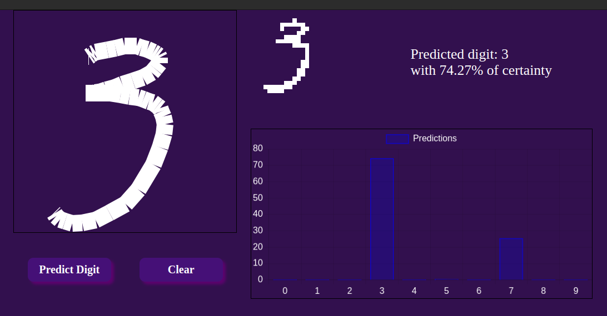

# Digit Recognizer

This project is a web-based digit recognition application that allows users to draw digits on a canvas and get real-time predictions using a pre-trained machine learning model. The application leverages TensorFlow.js for model inference and provides an interactive interface for users to test the digit recognition capabilities.




[Digit Recognition](https://kroxon.github.io/Digit_Recognition_ML/)

## Features

- **Interactive Canvas**: Draw digits on a canvas and get instant predictions.
- **Real-time Predictions**: Uses a pre-trained TensorFlow.js model to predict the drawn digit.
- **Clear Functionality**: Easily clear the canvas and reset predictions with a single click.
- **Responsive Design**: Works seamlessly on various screen sizes and devices.

## Technologies Used

- **TensorFlow.js**: For loading and running the pre-trained machine learning model.
- **JavaScript**: Core language for implementing the application logic.
- **HTML5 Canvas**: For drawing and capturing user input.
- **CSS**: For styling the application interface.

## Getting Started

### Prerequisites

- Node.js and npm installed on your machine.

### Installation

1. Clone the repository:
   ```bash
   git clone https://github.com/kroxon/Digit_Recognition_ML.git
   cd Digit_Recognition_ML
   ```

2. Install the dependencies:
   ```bash
   npm install
   ```

3. Start the development server:
   ```bash
   npm run dev
   ```

4. Open your browser and navigate to `http://localhost:8080` to see the application in action.

## Usage

1. Draw a digit on the canvas.
2. Click the "Predict Digit" button to get the prediction.
3. Click the "Clear" button to reset the canvas and predictions.

## Contributing

Contributions are welcome! Please open an issue or submit a pull request for any improvements or bug fixes.

## License

This project is licensed under the MIT License - see the [LICENSE](LICENSE) file for details.

## Acknowledgements

- [TensorFlow.js](https://www.tensorflow.org/js) for providing the tools to run machine learning models in the browser.
- [GitHub Pages](https://pages.github.com/) for hosting the application.